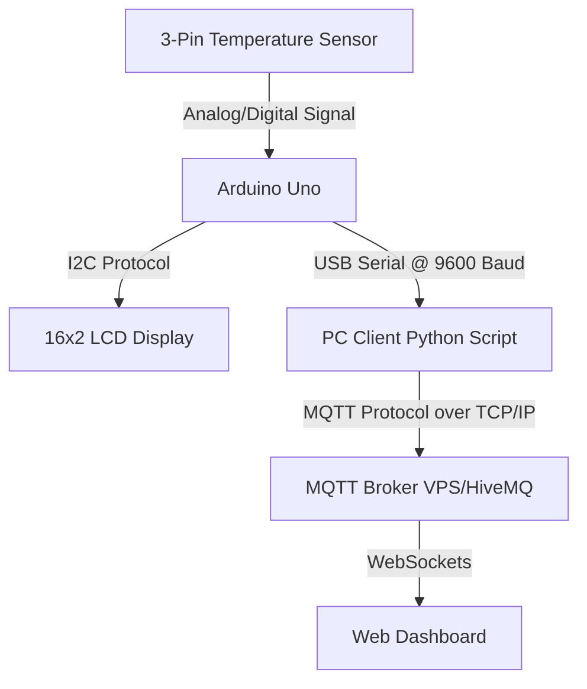

# Temperature Display and MQTT Monitoring System

This project is designed and implemented as part of the **SPE (Embedded Systems Software Integration)** Trade Code requirements. It monitors temperature values via an Arduino Uno, displays the candidate's name and temperature on an I2C 16x2 LCD, sends the readings to a PC via serial port, and forwards them to a remote MQTT Broker for real-time visualization on a web dashboard.

---

## 1. System Architecture

The following diagram illustrates the complete data flow of the system:



### Flow Explanation:
1. **Temperature Sensor** senses the environmental temperature.
2. **Arduino Uno** reads the sensor data, processes it, displays the name **UWASE Sonia** on the first row (with auto-scroll fallback support if names exceed 16 characters), displays the temperature on the second row, and writes it to the serial port.
3. **PC Program (Python)** continuously monitors the serial port, reads the incoming temperature, outputs it to the console, and publishes it to the MQTT Broker.
4. **MQTT Broker** acts as the central hub, routing messages.
5. **Real-time Web Dashboard** connects to the broker via WebSockets, rendering temperature trends and historical data.

---

## 2. Hardware Connections

### A. 16x2 LCD with I2C Interface (4 Pins)
The I2C LiquidCrystal display requires only 4 pins instead of the standard parallel interface.
| LCD Pin | Arduino Pin | Description |
|:---:|:---:|:---|
| **GND** | **GND** | Ground Reference |
| **VCC** | **5V** | Power Supply (5V) |
| **SDA** | **A4** (or SDA) | I2C Data line |
| **SCL** | **A5** (or SCL) | I2C Clock line |

### B. Temperature Sensor (3-Pin Digital Sensor)
Your selected physical connection configuration (DHT11/DHT22/DS18B20 digital sensor) is pre-configured as the active default in the firmware:
* **VCC** -> Arduino **3.3V**
* **GND** -> Arduino **GND**
* **DATA** -> Arduino **Pin 2 (D2)**

| Sensor Pin | Arduino Pin | Description |
|:---:|:---:|:---|
| **VCC** | **3.3V** | Power Supply (3.3V) |
| **DATA** | **Pin 2** | Digital I/O Data Line (Uses internal/external pull-up if not on a module) |
| **GND** | **GND** | Ground |

---

## 3. Communication Configurations

As requested by the specification, here are the exact names and parameters utilized in the system:

* **Serial Communication (Arduino to PC):**
  * **Baud Rate:** `9600`
  * **Data Bits:** `8`
  * **Parity:** `None`
  * **Stop Bits:** `1`
  * **COM Port:** Auto-detected (e.g., `COM3` on Windows or `/dev/ttyUSB0` on Linux)
* **MQTT Communication:**
  * **Broker Address:** `broker.benax.rw` (VPS Broker assigned for this assessment)
  * **TCP/IP Port:** `1883` (Standard) / WebSocket Port `9001` (Plain WebSockets)
  * **Topic Used for Publishing:** `uwase/sonia/temperature`
  * **Payload:** JSON format: `{"temperature": 25.4, "timestamp": 1718536800}` or plain numeric string `25.4`

---

## 4. Repository Structure

```text
├── README.md                  # System architecture, wiring, and setup instructions
├── arduino/
│   └── temperature_monitor/
│       └── temperature_monitor.ino  # Arduino firmware (supporting LM35/DHT and LCD scrolling)
├── pc_client/
│   ├── pc_monitor.py          # Python PC program (Serial-to-MQTT connector)
│   └── requirements.txt       # Python dependencies
└── dashboard/
    ├── index.html             # Premium Real-Time Dashboard UI
    ├── style.css              # Dark/Light Modern styling (Glassmorphism design)
    └── app.js                 # Dashboard logic (MQTT WebSockets connection & charting)
```
